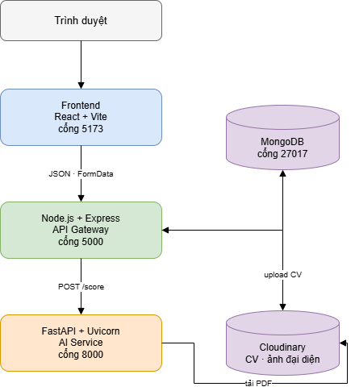
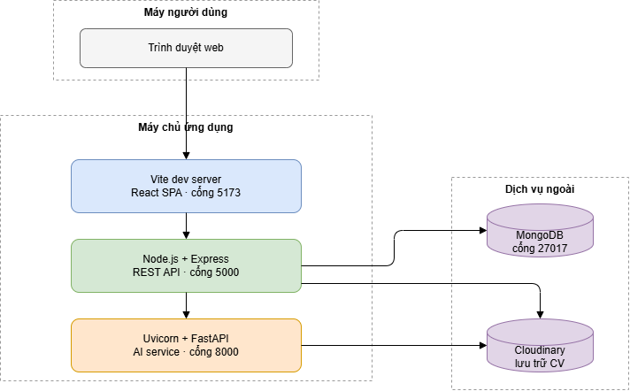
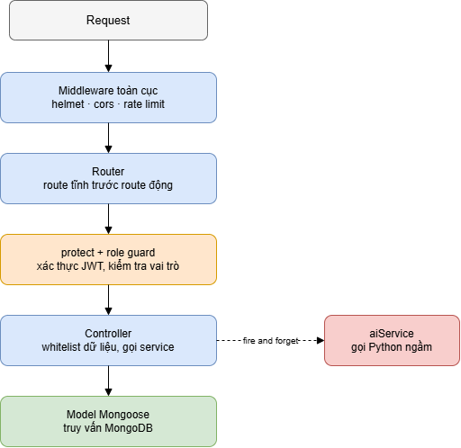
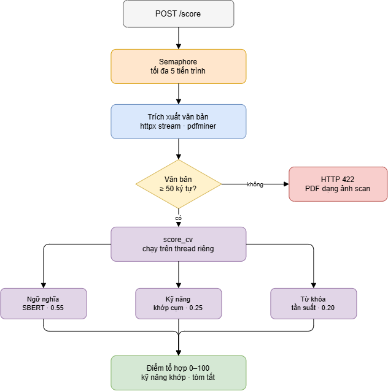
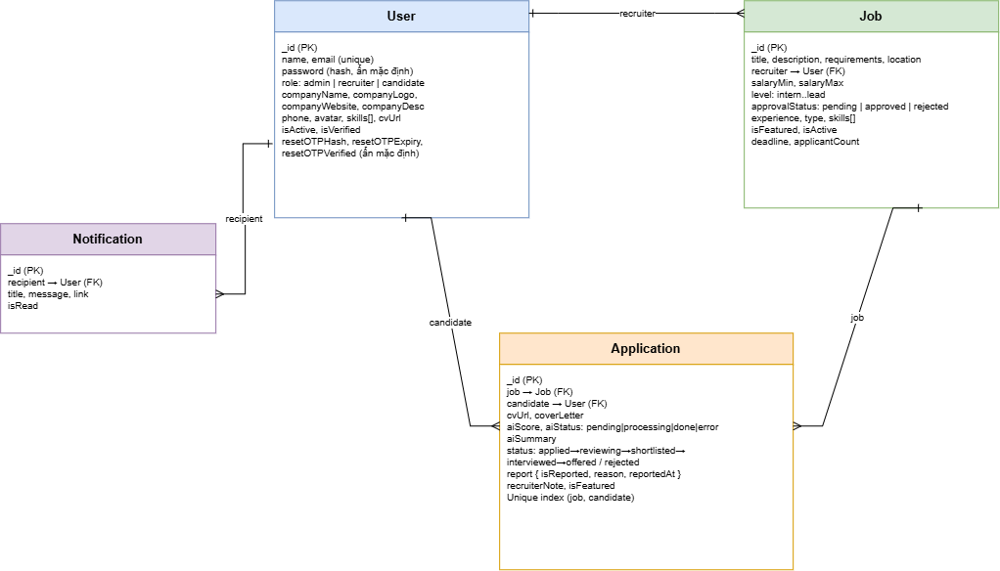
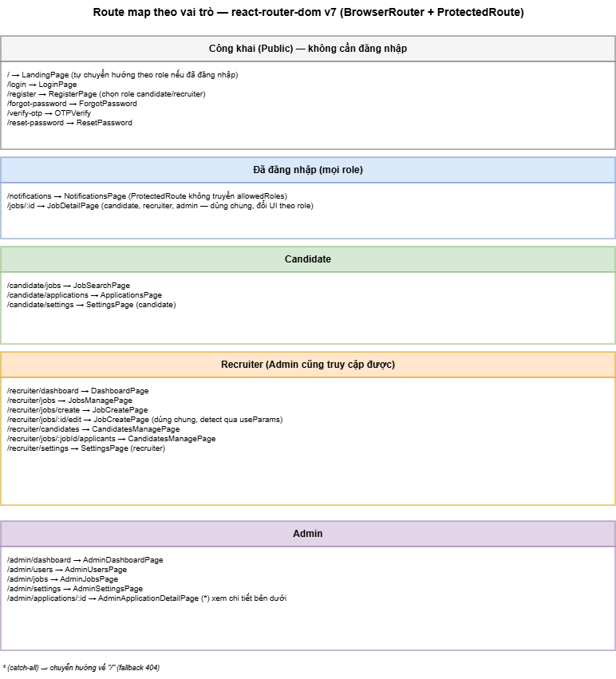
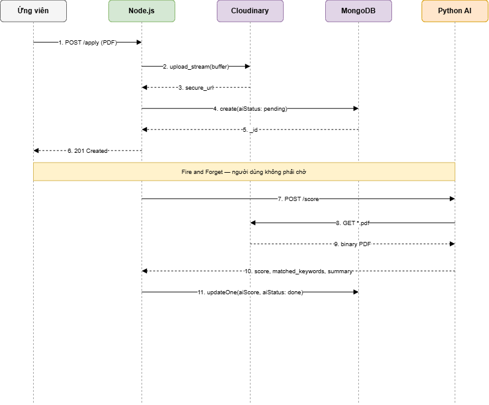
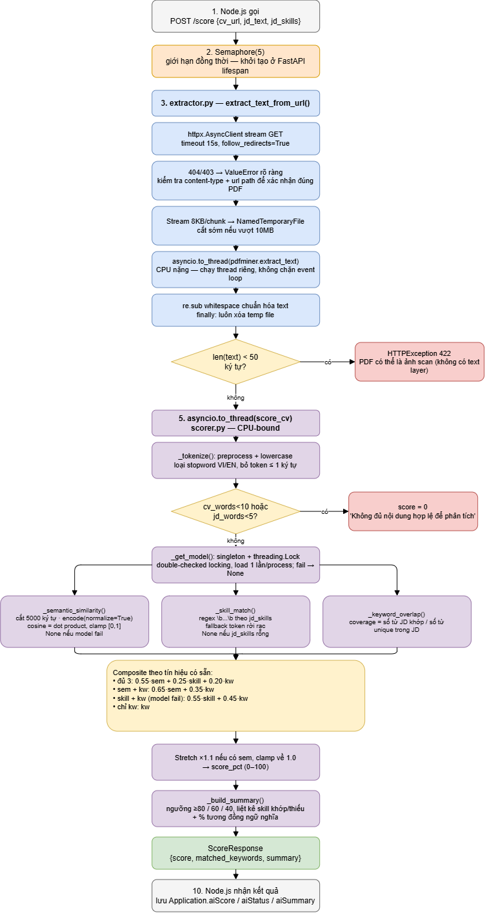
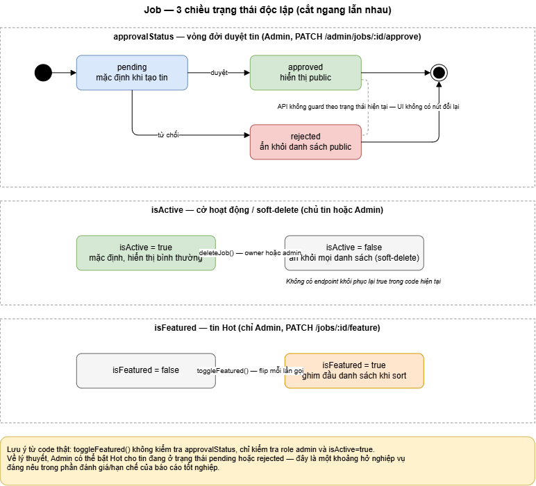
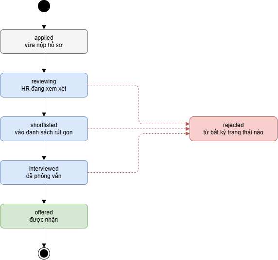

# Mini ATS — Hệ thống tuyển dụng tích hợp AI chấm điểm CV

Hệ thống Applicant Tracking System (ATS) thu nhỏ, được thiết kế theo mô hình phân tán với 3 phân hệ độc lập: **Frontend React**, **Node.js API Gateway**, và **Python AI Microservice**. Hệ thống cho phép ứng viên nộp CV PDF, sau đó AI tự động chấm điểm độ phù hợp với JD bằng công thức composite kết hợp **semantic similarity** (Sentence-Transformer đa ngôn ngữ Việt-Anh), **skill matching** (đối chiếu từng kỹ năng JD yêu cầu) và **keyword overlap** (độ phủ từ khóa JD trong CV) — không phải TF-IDF.

---

## Mục lục

1. [Kiến trúc tổng thể](#kiến-trúc-tổng-thể)
2. [Tính năng chính](#tính-năng-chính)
3. [Yêu cầu môi trường](#yêu-cầu-môi-trường)
4. [Cài đặt từng phân hệ](#cài-đặt-từng-phân-hệ)
5. [Cấu hình biến môi trường](#cấu-hình-biến-môi-trường)
6. [Cấu hình Cloudinary](#cấu-hình-cloudinary)
7. [Khởi chạy hệ thống](#khởi-chạy-hệ-thống)
8. [Tạo tài khoản admin](#tạo-tài-khoản-admin)
9. [Cấu trúc thư mục](#cấu-trúc-thư-mục)
10. [API Endpoints chính](#api-endpoints-chính)
11. [Luồng nghiệp vụ chính](#luồng-nghiệp-vụ-chính)
12. [Troubleshooting](#troubleshooting)

---

## Kiến trúc tổng thể

```
┌──────────────────────┐
│   Frontend (React)   │  Port 5173
│   Vite + Tailwind    │
└──────────┬───────────┘
           │ JSON / FormData (withCredentials)
           ▼
┌──────────────────────┐         ┌──────────────┐
│  Node.js API Gateway │ ◄─────► │   MongoDB    │
│  Express 5 + JWT     │         │   (Mongoose) │
│   Port 5000          │         └──────────────┘
└──────────┬───────────┘
           │                     ┌──────────────┐
           │ ◄─────────────────► │  Cloudinary  │
           │                     │   (CV/Avatar)│
           │                     └──────────────┘
           │ POST /score (cv_url, jd_text, jd_skills)
           ▼
┌──────────────────────┐
│ Python AI Service    │  Port 8000
│ FastAPI + Uvicorn    │
│ Sentence-Transformer │
└──────────────────────┘
```

*(Hình: sơ đồ kiến trúc tổng thể và sơ đồ triển khai chi tiết hơn — xuất từ `ats-diagrams.drawio` (trang "1-Kien-truc-tong-the" và "2-Trien-khai") vào `docs/images/`, đặt tên file đúng theo các placeholder bên dưới rồi bỏ comment.)*

<!--  -->
<!--  -->
<!--  -->
<!--  -->

**Tại sao tách 3 phân hệ:**
- **Frontend** chạy trên CDN, không cần biết backend logic
- **Node.js Gateway** xử lý nghiệp vụ chính, kết nối DB và file storage
- **Python AI** tách riêng vì tác vụ ML cần thư viện nặng (PyTorch, sentence-transformers), không nên đặt trên server xử lý request thường

**Giao tiếp Node.js ↔ Python:** một chiều, fire-and-forget. Node gọi `POST {AI_SERVICE_URL}/score` sau khi đã trả response cho client (timeout 60s để chịu được lần load model đầu tiên), Python không bao giờ gọi ngược lại Node.

---

## Tính năng chính

### Cho Ứng viên (Candidate)
- Đăng ký, đăng nhập (JWT access token 15 phút + refresh token trong cookie httpOnly, tự động rotate)
- Quên mật khẩu qua OTP 6 số — **lưu ý:** hệ thống hiện **chưa tích hợp gửi email thật**, OTP chỉ được `console.log` ở server khi `NODE_ENV !== 'production'` (xem [Troubleshooting](#troubleshooting))
- Tìm kiếm việc làm với bộ lọc đa chiều: từ khóa, địa điểm, cấp bậc, loại hình, kinh nghiệm, khoảng lương; sắp xếp theo mới nhất / phổ biến / lương
- Nộp CV PDF (tối đa 5MB), AI tự động chấm điểm độ phù hợp với JD
- Theo dõi trạng thái hồ sơ ứng tuyển (applied → reviewing → shortlisted → interviewed → offered / rejected)
- Nhận thông báo (polling 30s) khi HR đổi trạng thái hồ sơ
- Cập nhật hồ sơ cá nhân (avatar, CV, kỹ năng, số điện thoại), đổi mật khẩu

### Cho Nhà tuyển dụng (Recruiter)
- Đăng tin tuyển dụng — mọi tin mới luôn ở trạng thái `approvalStatus: 'pending'`, cần admin duyệt mới hiển thị công khai
- Sửa / xóa mềm (soft delete, `isActive: false`) tin của chính mình
- Xem danh sách ứng viên theo từng job hoặc gộp tất cả tin của mình, lọc theo điểm AI / khoảng ngày nộp / từ khóa tên-email / đã đánh dấu nổi bật
- Đổi trạng thái đơn ứng tuyển kèm ghi chú nội bộ — hệ thống tự động thông báo cho ứng viên khi trạng thái đổi
- Đánh dấu ứng viên nổi bật
- Yêu cầu AI chấm lại điểm cho một hồ sơ (retrigger)
- Báo cáo đơn ứng tuyển nghi ngờ gian lận (CV giả...) cho admin xử lý
- Dashboard: KPI tổng quan (tổng tin, tin đang active, tổng đơn) + biểu đồ analytics (xu hướng đơn 30 ngày, tăng trưởng %, phễu trạng thái, top 5 tin nhiều ứng viên nhất, phân bố điểm AI theo khoảng)

### Cho Quản trị viên (Admin)
- Duyệt / từ chối tin tuyển dụng mới đăng
- Đánh dấu tin tuyển dụng nổi bật (Hot) — **đây là đặc quyền riêng của admin**, recruiter (kể cả chủ tin) không gọi được endpoint này
- Quản lý người dùng: xem danh sách, xem chi tiết kèm lịch sử hoạt động (job đã đăng / đơn đã nộp), xóa tài khoản vĩnh viễn kèm cascade xóa job/application liên quan. Hệ thống hiện **không có tính năng khóa/mở khóa tài khoản** — chỉ có xóa hẳn.
- Quản lý toàn bộ tin tuyển dụng (kể cả pending/rejected), xóa tin vi phạm — khi xóa sẽ cascade xóa mọi đơn ứng tuyển liên quan và gửi thông báo cho cả recruiter lẫn từng ứng viên bị ảnh hưởng
- Xem và xử lý báo cáo vi phạm do recruiter gửi lên, xem chi tiết một đơn ứng tuyển bất kỳ, xóa đơn vi phạm (hệ thống thông báo cho ứng viên trước khi xóa)
- Dashboard thống kê toàn hệ thống: KPI (số candidate/recruiter/job/application) + biểu đồ analytics (trend 30 ngày, tăng trưởng %, phân bố duyệt tin, phân bố trạng thái đơn, top 5 recruiter theo số tin đăng)

---

## Yêu cầu môi trường

| Phân hệ | Yêu cầu |
|---|---|
| Node.js | Khuyến nghị bản LTS hiện hành (repo không ghim version qua `engines`) |
| Python | >= 3.10 (dùng cú pháp `list[str] \| None` trong `app.py`) |
| MongoDB | Local hoặc MongoDB Atlas |
| RAM | Khuyến nghị tối thiểu 4GB — gói `torch` + `sentence-transformers` khá nặng |
| Cloudinary | Tài khoản free đủ dùng |

---

## Cài đặt từng phân hệ

### Bước 1 — Clone dự án

```bash
git clone https://github.com/minhhir/ATS_Project.git
cd ATS_Project
```

### Bước 2 — Cài đặt Backend Node.js

```bash
cd backend-node
npm install
```

### Bước 3 — Cài đặt Backend Python AI

```bash
cd ../backend-ai-python

# Tạo virtual environment
python -m venv .venv

# Kích hoạt virtual environment
# Windows PowerShell:
.\.venv\Scripts\Activate.ps1
# macOS / Linux:
source .venv/bin/activate

# Cài dependencies
pip install -r requirements.txt
```

**Lưu ý:** Lần đầu chạy AI service, model `sentence-transformers/paraphrase-multilingual-MiniLM-L12-v2` sẽ tự động tải về từ HuggingFace Hub. Cần kết nối internet trong lần chạy đầu tiên. Nếu model tải thất bại (không mạng, thiếu ổ đĩa...), `scorer.py` tự fallback về chấm điểm bằng keyword/skill overlap thay vì crash.

### Bước 4 — Cài đặt Frontend

```bash
cd ../frontend-ats
npm install
```

---

## Cấu hình biến môi trường

### `backend-node/.env`

Tạo file `.env` trong thư mục `backend-node/`. Đây là **toàn bộ** các biến mà code thực sự đọc (`grep process.env` trong `src/`):

```env
# Server
PORT=5000
CLIENT_URL=http://localhost:5173

# Database
MONGODB_URI=mongodb://127.0.0.1:27017/ats_project_db

# JWT secrets — tự sinh bằng: node -e "console.log(require('crypto').randomBytes(32).toString('hex'))"
JWT_ACCESS_SECRET=<secret_chuỗi_dài>
JWT_REFRESH_SECRET=<secret_khác_dài>
JWT_ACCESS_EXPIRES=15m
JWT_REFRESH_EXPIRES=7d

# Cloudinary — lấy ở dashboard Cloudinary
CLOUDINARY_CLOUD_NAME=<your_cloud_name>
CLOUDINARY_API_KEY=<your_api_key>
CLOUDINARY_API_SECRET=<your_api_secret>

# AI Service URL
AI_SERVICE_URL=http://localhost:8000

# Tùy chọn — xem ảnh hưởng bên dưới
NODE_ENV=development
```

`NODE_ENV` không bắt buộc nhưng ảnh hưởng 3 chỗ trong code, đáng biết trước khi deploy:
- `authController.js`: cookie `refreshToken` chỉ set cờ `secure` khi `NODE_ENV === 'production'`.
- `authService.js`: OTP quên mật khẩu chỉ được log ra console khi `NODE_ENV !== 'production'`.
- `server.js` (error middleware): `stack` trace chỉ được trả về response khi `NODE_ENV` **đúng bằng** chuỗi `'development'` — để trống hoặc đặt giá trị khác (kể cả không set) sẽ ẩn stack trace.

### `frontend-ats/.env`

Tạo file `.env` trong thư mục `frontend-ats/`. Đây là biến duy nhất mà frontend đọc (`import.meta.env.VITE_API_URL`, dùng ở `src/api/axios.js`):

```env
VITE_API_URL=http://localhost:5000/api
```

### `backend-ai-python`

**Không cần và không đọc file `.env` nào cả.** `app.py` hard-code `host="0.0.0.0"`, `port=8000` và `MAX_CONCURRENT_TASKS = 5` ngay trong code — muốn đổi phải sửa trực tiếp `app.py`, không có cơ chế override qua biến môi trường.

---

## Cấu hình Cloudinary

Cloudinary dùng để lưu trữ file CV PDF và ảnh đại diện. **Có 2 setting bắt buộc** để hệ thống chạy được:

### Bước 1 — Đăng ký tài khoản

Truy cập [cloudinary.com](https://cloudinary.com) → đăng ký free → vào Dashboard.

### Bước 2 — Lấy credentials

Tại Dashboard, copy 3 giá trị:
- `Cloud name`
- `API Key`
- `API Secret`

Dán vào `backend-node/.env` ở các biến `CLOUDINARY_*`.

### Bước 3 — Bật quyền delivery cho PDF

**Đây là bước quan trọng nhất** — không có bước này thì Python sẽ bị 401/403 khi tải CV về để chấm điểm.

1. Vào **Settings** (icon bánh răng góc trái)
2. Chọn tab **Security**
3. Cuộn xuống mục **PDF and ZIP files delivery**
4. **Tick vào ô "Allow delivery of PDF and ZIP files"**
5. Bấm **Save**

---

## Khởi chạy hệ thống

Mở tối đa **4 terminal riêng biệt** (bỏ Terminal 1 nếu dùng MongoDB Atlas):

### Terminal 1 — MongoDB (nếu dùng local)

```bash
mongod
```

### Terminal 2 — Python AI Service

```bash
cd backend-ai-python

# Kích hoạt venv (nếu chưa)
.\.venv\Scripts\Activate.ps1   # Windows
# source .venv/bin/activate     # macOS/Linux

python app.py
```

Server luôn chạy tại `http://0.0.0.0:8000` (hard-code, xem mục biến môi trường ở trên). Kiểm tra healthcheck: `http://localhost:8000/health`.

### Terminal 3 — Node.js API

```bash
cd backend-node
npm run dev
```

Server chạy tại `http://localhost:5000` (theo `PORT` trong `.env`, mặc định 5000 nếu không set). Healthcheck: truy cập `http://localhost:5000/` sẽ thấy "Backend Mini ATS đang chạy!".

### Terminal 4 — Frontend

```bash
cd frontend-ats
npm run dev
```

Truy cập `http://localhost:5173` để vào ứng dụng.

---

## Tạo tài khoản admin

Vì phía API chặn việc đăng ký role `admin` qua `/api/auth/register` (`authService.js` chỉ whitelist `candidate`/`recruiter`), repo có sẵn script `backend-node/createAdmin.js` để tạo/ép tài khoản admin thẳng vào DB.

**Cách 1 — Dùng script có sẵn (khuyến nghị):**

```bash
cd backend-node
node createAdmin.js
```

Script kết nối tới `MONGODB_URI` trong `.env`, tự hash mật khẩu bằng bcrypt (cost 12) rồi `upsert` (có thì ghi đè, chưa có thì tạo mới) tài khoản:

- Email: `admin@neu.edu.vn`
- Mật khẩu: `admin123`
- Role: `admin`

⚠️ Email/mật khẩu này đang hard-code trong `createAdmin.js` (đã nằm trong source đã commit) — **đổi mật khẩu ngay sau khi đăng nhập lần đầu** và không dùng script này để tạo admin trên môi trường production mà không sửa lại giá trị mặc định.

**Cách 2 — Sửa tay qua mongosh (nếu muốn dùng email khác):**

```bash
mongosh ats_project_db
db.users.updateOne(
    { email: "your-email@example.com" },
    { $set: { role: "admin" } }
)
```

Cách này yêu cầu tài khoản đã tồn tại từ trước (đăng ký thường qua `/register`, mặc định role `candidate`). Đăng nhập lại để nhận quyền admin mới.

---

## Cấu trúc thư mục

*(Hình: sơ đồ thực thể-quan hệ (ERD) của 4 model Mongoose — xuất từ `ats-diagrams.drawio`, trang "7-ERD", vào `docs/images/07-erd.png`.)*

<!--  -->

Cây thư mục dưới đây liệt kê đúng file thật đang có trong repo (đã loại `node_modules`, `.venv`, `dist`, `__pycache__`, các thư mục cấu hình editor/IDE):

```
ATS_Project/
├── backend-node/                    # API Gateway (Node.js / Express 5)
│   ├── createAdmin.js               # Script tạo/ép tài khoản admin (xem mục 8)
│   └── src/
│       ├── config/
│       │   ├── db.js                # Kết nối MongoDB (Mongoose)
│       │   └── cloudinary.js        # Cấu hình SDK Cloudinary
│       ├── controllers/
│       │   ├── authController.js
│       │   ├── jobController.js
│       │   ├── applicationController.js
│       │   ├── adminController.js
│       │   └── notificationController.js
│       ├── middlewares/
│       │   ├── auth.js              # protect — verify JWT + load user
│       │   ├── role.js              # role(), isAdmin, isRecruiter, isCandidate
│       │   └── upload.js            # multer memoryStorage + upload lên Cloudinary
│       ├── models/
│       │   ├── User.js
│       │   ├── Job.js
│       │   ├── Application.js
│       │   └── Notification.js
│       ├── routes/
│       │   ├── authRoutes.js
│       │   ├── jobRoutes.js
│       │   ├── applicationRoutes.js
│       │   ├── adminRoutes.js
│       │   └── notificationRoutes.js
│       ├── services/
│       │   ├── authService.js       # Logic đăng ký/login/OTP/refresh token
│       │   └── aiService.js         # Gọi Python AI (fire-and-forget) + batch scoring
│       ├── utils/
│       │   └── AppError.js
│       └── server.js                # Entry point
│
├── backend-ai-python/                # AI Microservice (FastAPI)
│   ├── app.py                        # Entry point — endpoint /health, /score
│   ├── requirements.txt
│   └── services/
│       ├── extractor.py              # Tải PDF từ Cloudinary (httpx) + extract text (pdfminer)
│       └── scorer.py                 # Composite scoring: semantic + skill + keyword
│
├── docs/
│   └── images/                       # Hình xuất từ ats-diagrams.drawio (hiện chỉ có .gitkeep, chờ export)
│
├── ats-diagrams.drawio                # Nguồn 10 sơ đồ kiến trúc/luồng/ERD của dự án
│
└── frontend-ats/                     # Web UI (React 19 + Vite)
    └── src/
        ├── api/
        │   ├── axios.js              # Instance axios + interceptor refresh token
        │   └── endpoints.js          # ⚠️ Định nghĩa sẵn authAPI/jobsAPI/applicationsAPI nhưng
        │                             #    KHÔNG được import ở bất kỳ page nào — toàn bộ page gọi
        │                             #    thẳng `api.get/post/...` với path string. Dead code.
        ├── assets/                   # ⚠️ Rỗng — chưa sử dụng. CSS thật nằm trực tiếp ở
        │                             #    src/App.css và src/index.css, không ở đây.
        ├── components/
        │   ├── candidate/JobCard.jsx
        │   ├── layout/ProtectedRoute.jsx
        │   └── shared/
        │       ├── ChangePasswordForm.jsx
        │       ├── NotificationBell.jsx
        │       └── charts/           # BarChart, ChartCard, DonutChart, FunnelChart, LineChart, StatCard
        ├── context/
        │   └── AuthContext.jsx       # Session (accessToken in-memory + /auth/refresh khi mount)
        ├── data/
        │   └── locales/              # ⚠️ Rỗng — chưa sử dụng, chưa có i18n
        ├── hooks/
        │   ├── useChartWidth.js
        │   └── useFocusTrap.js
        ├── layout/                   # AuthLayout, CandidateLayout, RecruiterLayout, AdminLayout, DashboardShell
        ├── pages/
        │   ├── auth/                 # LoginPage, RegisterPage, ForgotPassword, OTPVerify, ResetPassword
        │   ├── candidate/            # JobSearchPage, JobDetailPage, ApplicationsPage, SettingsPage
        │   ├── recruiter/            # DashboardPage, JobsManagePage, JobCreatePage, CandidatesManagePage, SettingsPage
        │   ├── admin/                # AdminDashboardPage, AdminUsersPage, AdminJobsPage, AdminSettingsPage, AdminApplicationDetailPage
        │   ├── shared/NotificationsPage.jsx
        │   └── LandingPage.jsx
        ├── redux/                    # ⚠️ Rỗng — chưa sử dụng, quản lý state hiện tại chỉ dùng Context API
        ├── services/                 # ⚠️ Rỗng — chưa sử dụng
        ├── ui/                       # Badge, Button, Card, ConfirmDialog, Input, Logo, Skeleton, Textarea
        ├── utils/chartColors.js
        ├── App.jsx                   # Toàn bộ route
        └── main.jsx                  # Entry point
```

---

## API Endpoints chính

*(Hình: route map theo vai trò — xuất từ `ats-diagrams.drawio`, trang "10-Route-map-vai-tro", vào `docs/images/10-route-map-vai-tro.png`.)*

<!--  -->

Các bảng dưới liệt kê route **đúng theo thứ tự khai báo thật** trong từng file ở `backend-node/src/routes/`. Cột "Quyền" ghi middleware thật đang gắn trên route đó — `isRecruiter` trong code cho phép cả `recruiter` lẫn `admin` (không chỉ recruiter), `isCandidate` chỉ cho `candidate`.

### Auth (`/api/auth`)
| Method | Endpoint | Quyền |
|---|---|---|
| POST | `/register` | Public (rate-limit 20 req/15 phút/IP) |
| POST | `/login` | Public (rate-limit 20 req/15 phút/IP) |
| POST | `/refresh` | Public — đọc cookie `refreshToken`, rotate cả 2 token |
| POST | `/logout` | Public — xóa cookie `refreshToken` |
| GET | `/me` | protect |
| POST | `/forgot-password` | Public — luôn trả success để không lộ email tồn tại |
| POST | `/verify-otp` | Public |
| POST | `/reset-password` | Public |
| PUT | `/profile` | protect — multipart (`avatar`, `cv`, mỗi field 1 file) |
| PUT | `/change-password` | protect |

### Jobs (`/api/jobs`)
| Method | Endpoint | Quyền |
|---|---|---|
| GET | `/` | Public — lọc `isActive: true` **và** `approvalStatus: 'approved'`, chỉ tin đã duyệt mới lọt vào danh sách/tìm kiếm công khai |
| GET | `/featured` | Public — lọc `isActive && isFeatured && approvalStatus: 'approved'`, tối đa 6 tin. Endpoint tồn tại và hoạt động nhưng **không có page/component nào ở frontend gọi tới** (kể cả `LandingPage.jsx` cũng không fetch job nào) — chỉ được khai báo trong `endpoints.js` vốn cũng không được import ở đâu |
| GET | `/my-jobs` | protect + isRecruiter |
| GET | `/recruiter` | protect + isRecruiter — dropdown chọn job, chỉ trả `_id title isActive` |
| GET | `/stats/summary` | protect + isRecruiter — KPI dashboard |
| GET | `/stats/analytics` | protect + isRecruiter — dữ liệu biểu đồ |
| GET | `/:id` | Public có điều kiện — tin `approved` ai xem cũng được; tin `pending`/`rejected` chỉ chủ tin hoặc admin |
| PATCH | `/:id/feature` | protect + **isAdmin** — ⚠️ route này nằm trong `jobRoutes.js` cùng nhóm các route recruiter nhưng **chỉ admin** gọi được, không phải chủ tin (recruiter) |
| POST | `/` | protect + isRecruiter (từ đây route dùng `router.use(protect, isRecruiter)`) |
| PUT | `/:id` | protect + isRecruiter, controller check thêm chỉ chủ tin hoặc admin |
| DELETE | `/:id` | protect + isRecruiter, controller check thêm chỉ chủ tin hoặc admin — soft delete |

### Applications (`/api/applications`)
| Method | Endpoint | Quyền |
|---|---|---|
| POST | `/:jobId/apply` | protect + isCandidate + `upload.single('cv')` |
| GET | `/me` | protect + isCandidate |
| GET | `/job/:jobId` | protect + isRecruiter — `jobId='all'` gộp mọi tin của recruiter đang login |
| PATCH | `/:id/feature` | protect + isRecruiter |
| POST | `/:id/score` | protect + isRecruiter — trigger lại AI |
| PATCH | `/:id/status` | protect + isRecruiter |
| POST | `/:id/report` | protect + isRecruiter — *(đã sửa: trước đây chỉ có `protect`, không có role guard ở route, chỉ dựa vào controller tự so khớp `job.recruiter === req.user.id`; đã thêm `isRecruiter` cùng pattern các route recruiter-only khác trong file, controller vẫn giữ nguyên check ownership làm lớp phòng thủ thứ hai)* |

### Admin (`/api/admin`)
| Method | Endpoint | Quyền |
|---|---|---|
| GET | `/dashboard` | protect + checkAdmin (middleware `checkAdmin` cục bộ khai báo ngay trong `adminRoutes.js`, tương đương `isAdmin`) |
| GET | `/analytics` | protect + checkAdmin |
| GET | `/reports` | protect + checkAdmin — danh sách đơn bị report |
| GET | `/users` | protect + checkAdmin |
| GET | `/users/:id` | protect + checkAdmin |
| DELETE | `/users/:id` | protect + checkAdmin — cascade xóa job/application |
| GET | `/jobs` | protect + checkAdmin — mọi trạng thái duyệt |
| PATCH | `/jobs/:id/approve` | protect + checkAdmin |
| DELETE | `/jobs/:id` | protect + checkAdmin — cascade xóa application + notify |
| GET | `/applications/:id` | protect + checkAdmin ✅ — đã guard đầy đủ ở cả backend lẫn frontend (`/admin/applications/:id` trong `App.jsx` có `ProtectedRoute allowedRoles={['admin']}`) |
| DELETE | `/applications/:id` | protect + checkAdmin |

### Notifications (`/api/notifications`)
| Method | Endpoint | Quyền |
|---|---|---|
| GET | `/` | protect — trả **10** thông báo mới nhất |
| PUT | `/read-all` | protect |
| PATCH | `/:id/read` | protect — chỉ đánh dấu đọc thông báo của chính user (filter theo `recipient`) |

---

## Luồng nghiệp vụ chính

### Luồng 1 — Nộp CV và chấm AI tự động (Fire-and-Forget)

*(Hình: luồng nộp CV và pipeline chấm điểm AI chi tiết — xuất từ `ats-diagrams.drawio`, trang "5-Luong-nop-CV" và "8-Pipeline-AI-chi-tiet".)*

<!--  -->
<!--  -->

1. Candidate gửi PDF qua form upload (`POST /api/applications/:jobId/apply`)
2. Node.js validate file (chỉ PDF/ảnh theo mimetype, max 5MB), giữ trong RAM dạng Buffer (`multer.memoryStorage`)
3. Node.js stream Buffer lên Cloudinary, nhận `secure_url`
4. Node.js tạo bản ghi `Application` (`aiStatus: 'pending'`), tăng `applicantCount` của job (`$inc` atomic), tạo `Notification` cho recruiter
5. **Trả 201 cho candidate ngay** (không chờ AI)
6. Node.js gọi ngầm sang Python AI: `POST /score` (timeout 60s, không chặn response đã trả ở bước 5)
7. Python (`app.py` → `scorer.py`):
    - Đi qua `asyncio.Semaphore` (tối đa 5 task chấm điểm đồng thời)
    - Tải PDF từ Cloudinary (`extractor.py`, giới hạn 10MB), extract text bằng `pdfminer`; nếu text < 50 ký tự → trả lỗi 422 (nghi ngờ PDF scan ảnh)
    - Tokenize CV/JD, loại stop-word (Anh + Việt); nếu CV < 10 từ khóa hoặc JD < 5 từ khóa → trả thẳng điểm 0
    - Tính 3 tín hiệu độc lập: `semantic` (cosine similarity từ Sentence-Transformer, có thể `None` nếu model load lỗi), `skill_cov` (tỷ lệ skill JD khớp trong CV bằng regex word-boundary, `None` nếu job không khai skill), `kw_cov` (độ phủ từ khóa JD trong CV)
    - Trộn composite theo tín hiệu nào có mặt, ưu tiên semantic > skill > keyword — trọng số **luôn cộng lại đúng 1**:
      - Có đủ cả 3: `0.55×semantic + 0.25×skill + 0.20×keyword`
      - Không có skill (job không khai): `0.65×semantic + 0.35×keyword`
      - Không có semantic (model load lỗi): `0.55×skill + 0.45×keyword`
      - Chỉ có keyword: `= keyword`
    - Nếu có semantic: nhân thêm hệ số `×1.1` rồi clamp về tối đa 1.0 (bù cho việc cosine similarity của model multilingual hiếm khi vượt 0.85 với văn bản thật)
    - Trả về `{ score (0-100, làm tròn 1 chữ số thập phân), matched_keywords, summary }`
8. Node.js cập nhật `aiScore`, `aiSummary` và `aiStatus: 'done'` vào DB. Nếu bất kỳ bước nào ở Python lỗi/timeout, Node.js set `aiStatus: 'error'` (recruiter có thể bấm "chấm lại AI" — `POST /api/applications/:id/score` — để retry)

### Luồng 2 — Duyệt tin tuyển dụng

*(Hình: trạng thái tin tuyển dụng — xuất từ `ats-diagrams.drawio`, trang "9-Trang-thai-Job".)*

<!--  -->

1. Recruiter tạo job (`POST /api/jobs`) → backend luôn set `approvalStatus: 'pending'` (schema default, không nhận field này từ body)
2. Job không hiển thị ở danh sách/tìm kiếm công khai (`GET /api/jobs`) lẫn tin nổi bật (`GET /api/jobs/featured`) chừng nào còn `pending`/`rejected` — cả hai endpoint đều lọc `approvalStatus: 'approved'`
3. Trang chi tiết (`GET /api/jobs/:id`) cũng đúng thiết kế: tin `pending`/`rejected` chỉ chủ tin hoặc admin xem được, người khác nhận 403
4. Admin truy cập `/admin/jobs` (frontend), gọi `GET /api/admin/jobs` để xem tất cả jobs mọi trạng thái
5. Admin gửi `PATCH /api/admin/jobs/:id/approve` với body `{ status: 'approved' | 'rejected' }`
6. Tin `approved` chính thức hiển thị công khai; `rejected` vẫn tồn tại trong DB nhưng không public ở bất kỳ endpoint nào

> **Đã sửa (trước đây có bug):** `jobController.js` từng khai `const filter = { isActive, approvalStatus: 'approved' }` ở cấp module nhưng bị shadow bởi `const filter = { isActive: true }` khai lại bên trong `getJobs` — khiến tin `pending`/`rejected` từng lọt vào danh sách/tìm kiếm công khai dù trang chi tiết vẫn chặn đúng. Đã sửa bằng cách khai đúng `approvalStatus: 'approved'` ngay trong scope hàm ở cả `getJobs` và `getFeaturedJobs`, và xác nhận bằng test thủ công (seed 1 job `pending`, gọi `GET /api/jobs` không token → không xuất hiện; approve lại → xuất hiện; set `rejected` → biến mất lại).

### Luồng 3 — Báo cáo và xử lý đơn ứng tuyển vi phạm

*(Hình: trạng thái đơn ứng tuyển — xuất từ `ats-diagrams.drawio`, trang "6-Trang-thai-don".)*

<!--  -->

1. Recruiter nghi ngờ một CV giả mạo/spam → `POST /api/applications/:id/report` kèm `reason`, controller so khớp `job.recruiter` với người gọi trước khi set `report.isReported = true`
2. Admin xem danh sách báo cáo qua `GET /api/admin/reports` (sort theo `reportedAt` mới nhất)
3. Admin mở chi tiết (`GET /api/admin/applications/:id`), quyết định xóa (`DELETE /api/admin/applications/:id`)
4. Trước khi xóa, backend tạo `Notification` cảnh báo cho candidate (populate `job.title` trước vì sau khi xóa sẽ mất context), sau đó mới `findByIdAndDelete`

---

## Troubleshooting

### Backend Node.js không kết nối được MongoDB
- Kiểm tra `MONGODB_URI` trong `.env`
- Nếu dùng local, đảm bảo MongoDB đang chạy: `mongod`
- Nếu dùng Atlas, whitelist IP của bạn trong Network Access

### Không nhận được OTP quên mật khẩu
- Hệ thống **chưa gửi email thật** — `authService.js` chỉ `console.log` OTP ra terminal đang chạy `npm run dev` của `backend-node`, và chỉ khi `NODE_ENV !== 'production'`
- Nếu deploy với `NODE_ENV=production`, flow OTP hiện tại sẽ không có cách nào lấy được mã — cần tự tích hợp một dịch vụ gửi email trước khi dùng production

### Python AI báo lỗi 401/403 khi tải CV
- Vào Cloudinary Dashboard → Settings → Security
- Tick "Allow delivery of PDF and ZIP files" → Save
- Các CV cũ vẫn bị lỗi, chỉ CV nộp sau khi tick mới hoạt động

### Lỗi `Must supply api_key` khi nộp CV
- Kiểm tra `CLOUDINARY_*` trong `backend-node/.env`
- Đảm bảo `dotenv.config()` là dòng đầu tiên trong `server.js`

### Frontend reload liên tục / trắng trang sau khi đổi code
- Kiểm tra `useEffect` có dependency array đúng
- Clear Vite cache: `rm -rf node_modules/.vite` rồi `npm run dev`

### AI luôn trả 0/100 điểm
- Extractor (Python) từ chối PDF có text < 50 ký tự (nghi ngờ file scan ảnh, không có text layer) — lỗi 422
- `scorer.py` trả thẳng 0 điểm nếu sau khi tokenize và loại stop-word, CV còn dưới **10** từ khóa hoặc JD còn dưới **5** từ khóa — kiểm tra job có `description`/`requirements` đủ nội dung thực chất, không phải JD viết vài dòng ngắn

### CV cũ bị kẹt `aiStatus: 'error'`
- Mở MongoDB Compass, vào collection `applications`, sửa `aiStatus` về `'pending'`
- Hoặc gọi lại `POST /api/applications/:id/score` (cần đăng nhập với vai trò `recruiter` hoặc `admin`, và phải là chủ tin hoặc admin)

### Đăng nhập xong F5 bị về login
- Đảm bảo `AuthContext.jsx` có `useEffect` gọi `POST /auth/refresh` rồi `GET /auth/me` khi mount (đã có sẵn trong code)
- Kiểm tra cookie `refreshToken` được set với `httpOnly`, `sameSite: 'strict'`, và `secure` khớp với việc bạn có chạy HTTPS hay không (`secure` chỉ bật khi `NODE_ENV=production`)

---

## Công nghệ sử dụng

**Frontend:**
- React 19 + Vite
- React Router v7
- Tailwind CSS 3 + `@tailwindcss/forms` + `tailwindcss-animate`
- lucide-react (icon)
- Axios với interceptor tự refresh token (hàng đợi request khi đang refresh, rotate token khi 401)
- `clsx` + `tailwind-merge` (ghép class có điều kiện)
- `@tanstack/react-query` có trong `package.json` nhưng **không được dùng ở đâu trong code** — mọi trang tự quản lý fetch bằng `useState`/`useEffect` gọi thẳng axios

**Backend Node.js:**
- Express 5
- Mongoose 9 (MongoDB ODM)
- bcryptjs (hash password, cost 12)
- jsonwebtoken (access + refresh token)
- multer + cloudinary + streamifier (upload file qua RAM buffer, không lưu đĩa)
- helmet, cors, express-rate-limit, cookie-parser (bảo mật)

**Backend Python:**
- FastAPI + Uvicorn
- pdfminer.six (trích xuất text từ PDF)
- sentence-transformers + torch (semantic similarity, model `paraphrase-multilingual-MiniLM-L12-v2`)
- httpx (tải PDF async, streaming, giới hạn size)
- pydantic (validate request/response)

**Database & Storage:**
- MongoDB
- Cloudinary (CV PDF + avatar)

---

## Tác giả

**Hoàng Năng Minh** — Xây dựng hệ thống ATS tích hợp AI chấm điểm CV tự động

---

## License

Dự án này được phát triển cho mục đích học tập. Vui lòng không sử dụng cho mục đích thương mại nếu chưa có sự đồng ý của tác giả.
